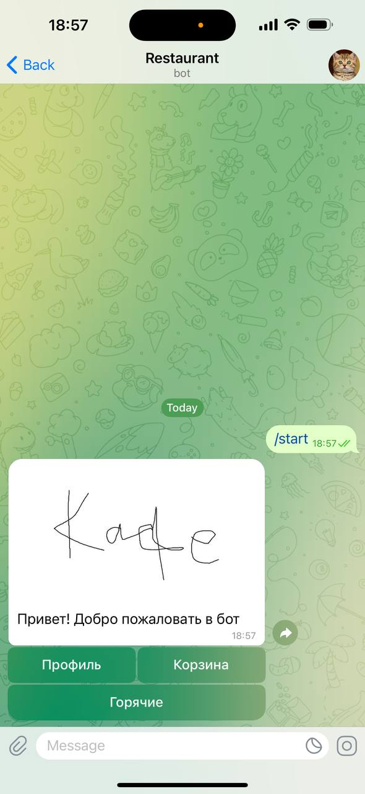
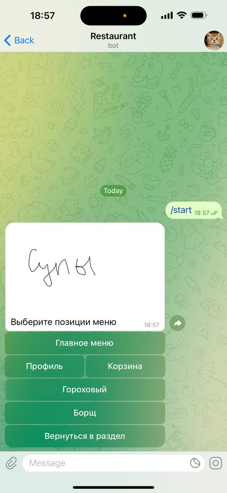
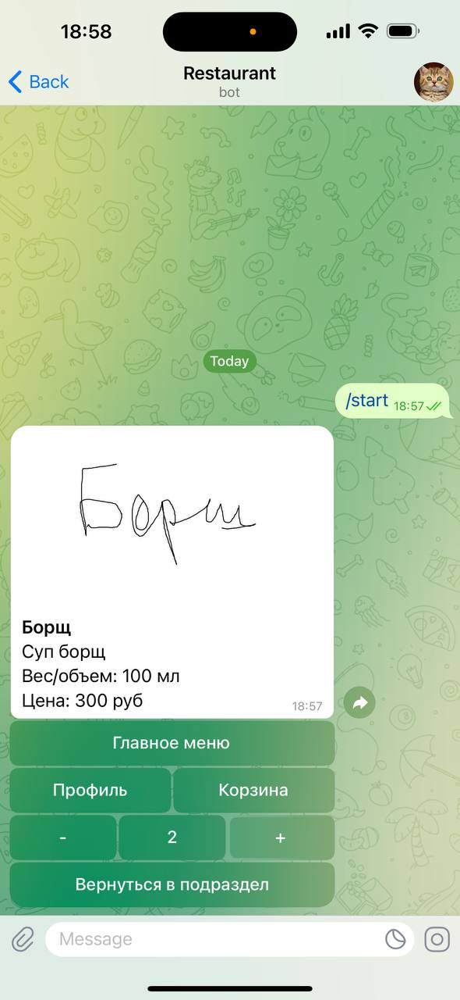
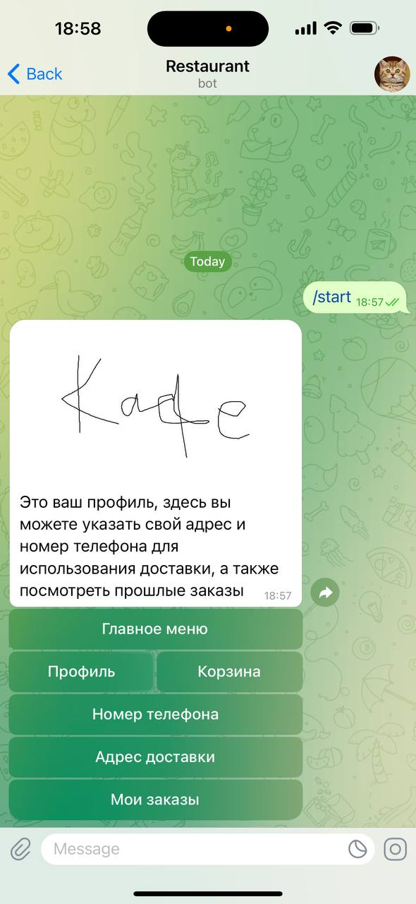
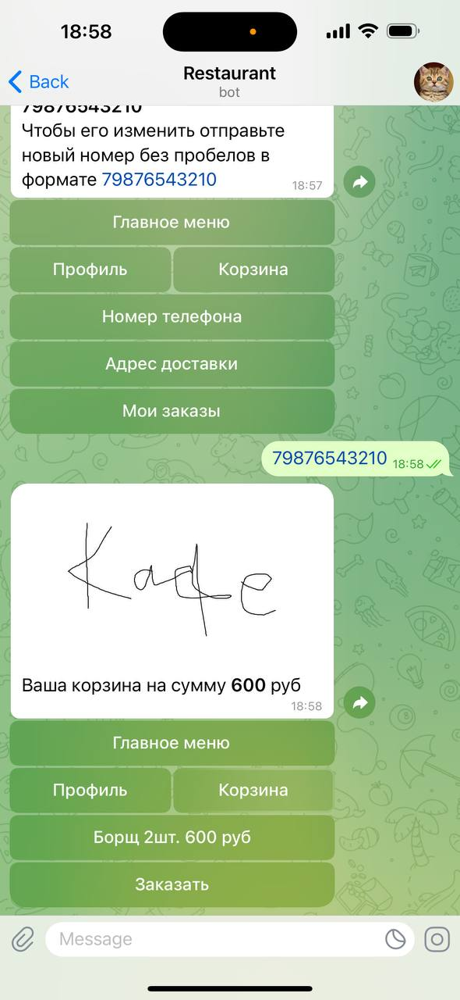
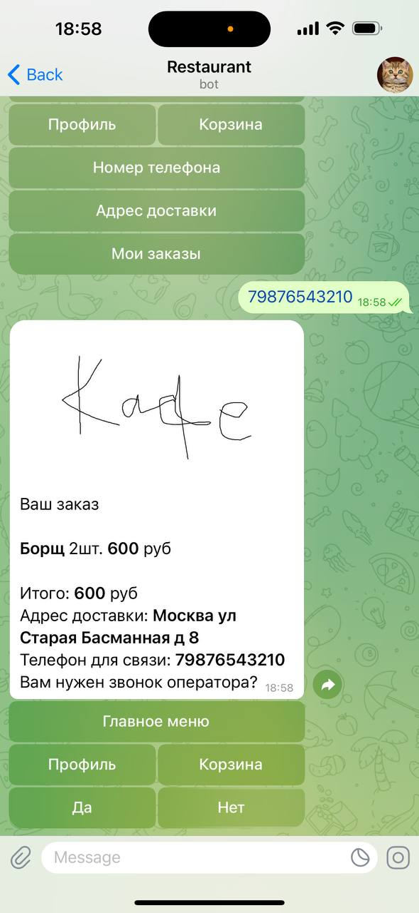
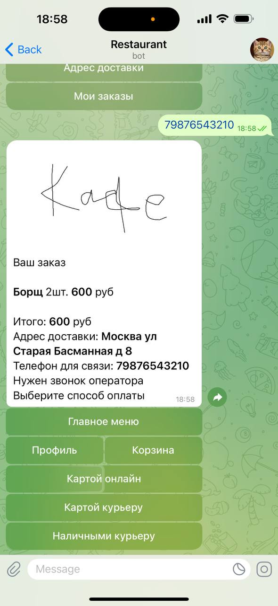
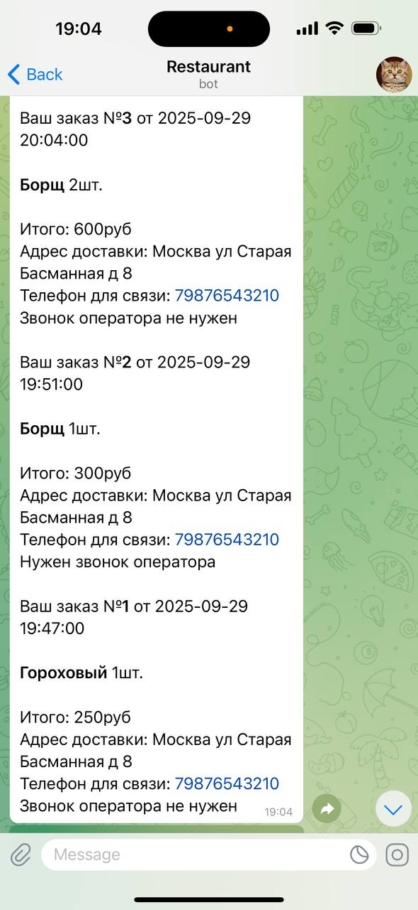
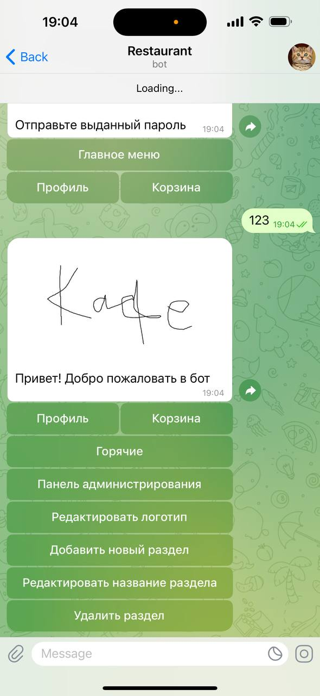

# aiogram-restaurant

<div style="display: grip; gap: 25px; grip-column-template: repeat(2, 250px); margin: auto;">
    
    
    
    
    
    
    
    
    
    
</div>

# About the project

My friend suggested me to create a bot for a restaurant. So here it is. We tried to offer our product to local cafe, but the owner was not so interested in it, so our attempt was unsuccessful.

Bot provides deliveries for restaurants. There user can see restaurant's menu and make an order. All menu is fully customizable and can be
modified within the bot itself. Bot also provides profile page, where user adds his phone number and delivery address, cart page for ordering and menu
stop list. Any bot feature can be added or edited, if it's needed. In next updates in the bot can be added statistics (mean bill, amount of orders,
most ordered positions, etc.) and profile bonus system, where bonuses can be added to a user for ordering with the bot and used as a discount.

Restaurant's menu divided into menu sections. Menu sections can store menu positions or menu subsections, which stores menu positions.
```bash
Menu
├── Menu section
│   ├── Menu position
│   └── Menu position
│
└── Menu section
    ├── Menu subsection       
    │   ├── Menu position       
    │   └── Menu position
    │
    └── Menu subsection      
        ├── Menu position       
        └── Menu position
```

User can select different payment methods:
pay by cash
pay by card
pay online
If user selects pay online, the payment invoice is being sent to the user and user fills in his card info, if user selects other payment method, he pays to a courier.

Bot also has admin panel. To open it write /admin. To login write /login, to logout - /logout. Staff can authorize there by staff login and password,
created and sent by his boss. One person can have multiple staff positions. There are three types of staff:
admin, who edits menu and staff lists
operator, who processes incoming orders
kitchen, who can only see confirmed orders

When a user creates an order, the order is sent to the operators. Operators firstly press Process button to let other operators know, that this
order is already being processing. Then he contacts customer if it's needed and confirms or declines this order. Operator can add a note for the order.
If the order is confirmed it's sent to kitchen.


# Main functions

- Creating, editing, deleting menu
- Menu stop-list
- Creating orders
- User profile

# Used in project

- Python 3.8+
- Aiogram - for operating the telegram bot
- Psycopg2 (PostgreSQL) - for operating the database

# Downloading and running the bot

### 1. Download [Python](https://www.python.org/) and IDE

You can use any IDE you want, for example: PyCharm, VSCode, Python IDLE, etc.

### 2. Download ZIP or use git clone

```bash
git clone https://github.com/middelmatigheid/aiogram-restaurant.git
cd aiogram-restaurant
```

### 3. Create virtual environment

If you are using Linux/MacOS

```bash
python -m venv venv
source venv/bin/activate
```

If you are using Windows

```bash
python -m venv venv
venv\Scripts\activate 
```

### 4. Install requirements

```bash
pip install -r requirements.txt
```

### 5. Set up the database

- Download [PostgreSQL](https://www.postgresql.org/)
- Configure the database in pgAdmin4

### 6. Create a telegram bot

Create a telegram bot using [@BotFather](https://telegram.me/BotFather), add payment method

### 7. Create .env file

Create .env file in the main directory and set up the values

```bash
BOT_TOKEN='YOUR BOT TOKEN'
PAYMENT_TOKEN='YOUR PAYMENT TOKEN'
HOST='YOUR HOST'
DBNAME='YOUR DBNAME'
USER='YOUR USERNAME'
PASSWORD='YOUR PASSWORD'
PORT=YOUR PORT
```

### 8. Create folders

Create folders **sections**, **subsections**, **positions** in **images** folder

### 9. Run the bot

```bash
python main.py
```

# Project structure

```bash
aiogram-restaurant/
├── main.py               # Main file to run the bot
├── handlers.py           # File for handling bot's requests
├── database.py           # File for operating the database
├── keyboards.py          # File for creating keyboards
├── images                # Folder of images
│   ├── sections          # Folder of menu sections images
│   ├── subsections       # Folder of menu subsections images
│   ├── positions         # Folder of menu positions images
│   └── logo.jpg          # Logo image
├── requirements.txt      # Python requirements
└── .env                  # Environment variables
```


